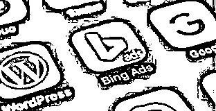

# Bing 广告投放：很多外贸人都开始逐步转战 Bing 了

> 原文：[`www.yuque.com/for_lazy/xkrm14/nchvbkhbl5fhugc7`](https://www.yuque.com/for_lazy/xkrm14/nchvbkhbl5fhugc7)

作者： 国强，坐标日本

日期：2023-06-13

点赞数：85

正文：

Bing 广告投放 目前，很多外贸人都开始逐步转战 Bing 了。 谷歌广告（Google Ads）因为众所周知，所以比较火热，广告竞争也就比较大了。而 Bing 作为搜索引擎市场份额的老二，广告这方面的火热程度也是远远低于 Google Ads 的，所以竞争小，广告成本会低很多。 (大白话就是微软 靠着 OpenAI 和 Bing 结合的 New Bing 想要在广告投放这边跟谷歌 PK 一下。 基本都是砸钱，给红利的打法) 微软于 2019 年 4 月将必应广告平台（Bing Ads）更名为 Microsoft Advertising。 他们将 Bing Ads 与其他单独的广告工具和服务合并。 于是现在，广告主可以同时在 Bing 搜索引擎和 Microsoft 受众群体网络（包括 MSN 和许多其他网站）上展示广告。 Microsoft Advertising 本质上等同于 Google Ads 搜索广告。 其工作原理如下： 人们在 Bing 搜索引擎中输入搜索词，如果你的广告中的关键字与搜索词相匹配，则你的广告将显示在必应搜索结果的旁边或上方。 你可以配置广告让人们访问网站、打电话或直接上门等。 <开个脑洞> 目前，对于生成 AI（如 ChatGPT）等技术，人们主要关注 AI 生成的文本、图像和语音。然而，从商业角度来看，用户在聊天中输入的信息同样重要。 与生成 AI 的聊天中，不仅可以获得用户的推理、问题意识、用语和情感等内在个人信息，还可以通过 AI 的提问有意引导用户有意地提供这些信息。微软早已将其自家搜索服务"Bing"与生成 AI 相结合，从而实现了更精细的用户个人资料构建。当用户行为预测的准确度提高时，广告业务的收益能够扩大。 做套壳产品的亲 这也是一个思路。 因为你的产品里能沉淀，用户输入内容 和 GPT 反馈内容。 根据用户输入内容和 GPT 反馈内容你可以自己建立一个用户像 ------------------------前方高能--------------- 从"流量-产品- 变现"的最小产品变现模型的角度来分析这个 Bing 广告投放的例子： 1.流量：Bing 作为搜索引擎市场份额的老二，虽然广告热度较低，但其庞大的用户群体及相对较低的广告竞争力，使得广告主更容易以较低的成本获取流量。同时，Bing 与 Microsoft 的其他服务和产品（如 MSN、ChatGPT 等）的整合，使得 Bing 可以通过多渠道获取更多的用户流量。 2.产品：在此例中，产品主要是 Bing 提供的广告服务。通过用户在 Bing 搜索引擎中输入的关键字，广告主可以将自己的广告精准地展现给符合条件的用户。此外，通过与 ChatGPT 等 AI 技术的结合，Bing 可以对用户的行为进行更精确的预测，从而使广告服务的精准度更高。 3.变现：对于 Bing 来说，其变现主要来源于广告收入。对于广告主来说，他们通过在 Bing 上投放广告，引导用户访问网站、打电话或直接上门等，从而将流量转化为实际的销售收入。 对于做套壳产品的企业来说，通过收集用户输入内容和 AI 反馈内容，他们可以建立一个用户像，以此来优化产品、提升用户体验、提高用户粘性，进一步增加用户流量，提高产品销售，实现商业变现。

  

评论区：

郭宏 : 给个评论，👍

国强，坐标日本 : 笔芯！

国强，坐标日本 : 关于，Microsoft 受众群体网络这一部分也有可能阐述的不够明确不够细致，也没有数据支撑。我也有个人认知偏差，风口来了只能争取先把方向说出来，至于详细的数据考察等等做了在去精华帖发帖试一试

朱朱侠 : 这个脑洞开的有点不走寻常路[强]

国强，坐标日本 : hhh

国强，坐标日本 : 广告业界里，这种操作是常态

公众号懒人找资源，懒人专属群分享

