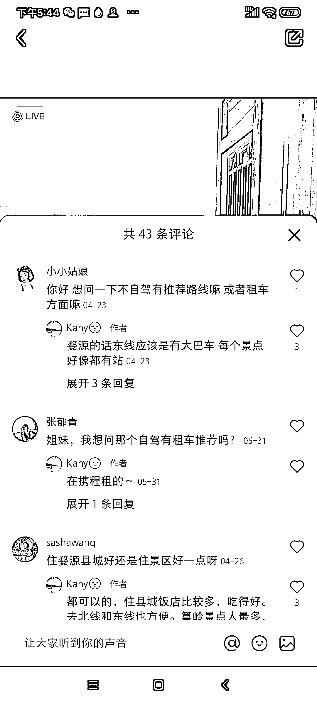

# 暑假毕业季，旅游业务合作机会来临

> 原文：[`www.yuque.com/for_lazy/xkrm14/wmrun9g2o4bsfnyv`](https://www.yuque.com/for_lazy/xkrm14/wmrun9g2o4bsfnyv)

作者： 小仪

日期：2023-06-30

点赞数：83

正文：

暑假毕业季，又是旅游旺季，有旅游相关资源和业务的朋友可以和当地自驾租车联动或合作

  

评论区：

小仪 : 谢谢亦仁老板

Frank 老师 : 理解：暑假毕业季与旅游旺季重叠，是旅游相关业务蓬勃发展的时期。此时，旅游资源方与当地自驾租车服务商的联动或合作能带来更多商业机会。借助 ChatGPT，我们可以提供基于用户行程的个性化旅游建议，甚至生成自驾游规划方案，以增加用户体验并创造更多的商业价值。

胖大魔 : 在于当地靠谱汽车资源的调动与链接 sop.流程与落地交付体验 保障机制

胖大魔 : 基于当地靠谱汽车资源的调动与链接，以及具体的 SOP 流程和落地交付体验，可以建立以下保障机制来确保旅游的顺利进行： 1. 车辆调动与链接机制：建立稳定的合作伙伴关系，与当地的靠谱汽车资源提供商合作，确保每次旅游活动都能够提供所需的汽车服务。这可以通过签订长期合作协议、建立车辆调度系统等方式实现。 2. 服务合同与保证金：与汽车资源提供商签订详细的服务合同，明确双方的责任和权益，并约定违约责任和赔偿机制。同时，可以要求汽车资源提供商提供一定的保证金，作为履约保障。 3. SOP 流程设计：制定详细的 SOP 流程，包括预订车辆、接待客人、行程安排、车辆调度、安全检查等环节。确保每个环节都有明确的责任人和操作规范，以提升服务品质和客户满意度。 4. 质量监控与评价机制：建立监控机制，对每次旅游活动的车辆和服务质量进行评估。可以通过客户满意度调查、巡查检查等方式进行监控，并根据评估结果对供应商进行奖惩和绩效考核，以确保提供高质量的服务。 5. 紧急支持与救援机制：制定紧急情况处理方案，包括故障车辆的快速替换、客户意外事件的应急响应等。与汽车资源提供商建立紧急联系机制，以保证在紧急情况下能够及时提供救援和支持。 通过建立以上保障机制，可以确保旅游活动中的汽车资源调动与链接顺利进行，提供优质的服务体验，并在遇到问题时能够及时解决。 写这个只是个参考过程，实战过才知道难度，资源调动难度

胖大魔 : 当然，我们可以使用 5W2H 模型（Who、What、When、Where、Why、How、How Much）来更深入地分析旅游租车行业： 1. Who（谁）：主要参与者是谁？这包括租车公司、汽车供应商、旅行社、在线旅游平台、顾客等。在这个环节，我们需要了解他们的需求、行为和决策影响因素。 2. What（什么）：我们需要提供什么产品或服务？这涉及到旅游租车服务、增值服务（例如导航系统、保险等）和客户服务。 3. When（何时）：服务是何时提供的？这可能涉及旺季和淡季、节假日、特殊活动等。 4. Where（哪里）：服务在哪里提供？可能涉及到在城市、国家或地区的分布，以及在线和线下服务的选择。 5. Why（为什么）：为什么顾客会选择我们的服务？这可能涉及到品牌声誉、价格、服务质量、车辆选择等。 6. How（如何）：我们如何提供服务？这可能涉及到营销和销售策略、供应链管理、合作伙伴关系、技术和平台等。 7\. How Much（多少）：提供这些服务需要多少资源？这可能涉及到投资、运营成本、收入和利润等。 通过这种方式，我们可以更全面地了解旅游租车行业的运营模式和市场环境，以制定有效的商业策略。[成功]

Alex : 恭喜中标[强]

程序员八两 : 咋有 gpt 既视感[捂脸]

公众号懒人找资源，懒人专属群分享

