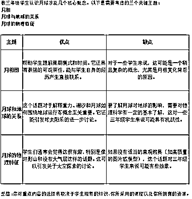

# OpenAI 宣布 Custom Instruction 功能，个性化满足用户需求

> 原文：[`www.yuque.com/for_lazy/xkrm14/obfo8aytx7bszu4b`](https://www.yuque.com/for_lazy/xkrm14/obfo8aytx7bszu4b)

<ne-text id="u36882e80">作者： 文韬武韬</ne-text>

<ne-text id="u7f81ffd4">日期：2023-07-21</ne-text>

<ne-text id="u7167ac0b">点赞数：</ne-text><ne-text id="u57024c4c" ne-bold="true">75</ne-text>

<ne-hole id="u5262ca7b" data-lake-id="u5262ca7b"><ne-card data-card-name="hr" data-card-type="block" id="H2bSk" data-event-boundary="card">

<ne-text id="u510cf4d7">正文：</ne-text>

<ne-text id="ud3d28ae4">OpenAI 官宣 Custom Instruction 公布！ AI 的迭代速度实在是快！ 如果不升级自己知识与能力，初级 prompt</ne-text> <ne-text id="u01c66690">engineer 很快就要被淘汰！ 我把官方关于 Customer Instruction 的博客全部通读，总结详细的说明给大家。</ne-text> <ne-text id="u4ae95a2f">附件中的图片是做了 Customer Instruction 设置之后 ChatGPT 的回答，要了解详细情况请进来查看。 这个 Custom</ne-text> <ne-text id="u2a4f84ec">Instructions 功能，可以让我们预先设置生成内容的“首选项”或要求， 这个功能可以让 ChatGPT 更加有效的理解我们每个人的不同背景和独特需求。</ne-text> <ne-text id="ud0950f79">在设置了 Custom Instruction 之后，ChatGPT 会在每一个和每一次对话中，优先考虑我们这个预先设置的需求和角色。 举例： Custom</ne-text> <ne-text id="u706a9305">Instructions 设置：我是一个教小学三年级科学的老师。 问题：</ne-text> <ne-text id="uc57427cc">我在讨论工作相关的解决方案的时候，请以表格形式提供信息，概述每个方案的优缺点，以方便我比较和决策。 ChatGPT 的回答：（由于有表格，请见图片）</ne-text> <ne-text id="u8b7b9dd0">---------------------------------------------------------------------------------</ne-text> <ne-text id="u6b11e162">没有 Custom Instruction 设置之前，ChatGPT 的回复是这样的： 1、形成和结构：</ne-text> <ne-text id="u1122798d">关于月球，最重要的教学内容之一就是它的形成和结构。据说月球形成于大约 45 亿年前，即太阳系形成后不久。一种流行的理论是 "巨型撞击假说"（Giant</ne-text> <ne-text id="u14f5c27a">Impact Hypothesis），它认为一个被称为</ne-text> <ne-text id="u70469cbc">"忒伊亚"（Theia）的火星大小的天体与地球发生了碰撞，碰撞产生的碎片最终凝聚成了月球。就结构而言，月球有一层薄薄的地壳、地幔和一个小的、部分熔化的内核，与地球相似，但地质活动要少得多。</ne-text> <ne-text id="u5e50bb76">2、月相和潮汐 了解月相是天文学的一个重要方面。月球大约每 27.3</ne-text> <ne-text id="u8cc589bd">天绕地球公转一圈，在公转的过程中，太阳光照射到月球的角度会发生变化，从而导致从地球上可见的部分经历月相周期：新月、腊月、第一季度、腊月、满月、腊月、最后一季度和腊月。此外，月球的引力会影响地球的海洋，造成潮汐。月球与太阳一起造成潮涨潮落，这种效应对海洋生物和人类活动有重大影响。</ne-text> <ne-text id="u4be852ff">3、月球与太空探索： 月球在人类太空探索中发挥着至关重要的作用。20 世纪 60 年代和 70 年代的 "阿波罗 "任务是太空探索的一个重要里程碑，1969</ne-text> <ne-text id="u6a413c9d">年，"阿波罗 11 号</ne-text> <ne-text id="u32a84136">"飞船首次实现了两人登月。这些任务带回的月球岩石极大地促进了我们对月球和太阳系的了解。月球仍然是未来太空探索任务的焦点，因为在那里建立人类基地可以作为进一步探索太阳系（包括火星）的垫脚石。</ne-text> <ne-text id="uf6ccd427">---------------------------------------------------------------------------------</ne-text> <ne-text id="u5dd9d649">以下是 OpenAI 从早期测试人员那里了解到的一些使用案例： - 专业知识校准： 分享您在特定领域的专业知识水平，避免不必要的解释。 - 语言学习：</ne-text> <ne-text id="ue3c4b6fd">通过语法纠正寻求持续的对话练习。 - 本地化： 在特定国家的法律管辖下建立律师的持续背景。 - 小说写作： 使用人物表帮助 ChatGPT</ne-text> <ne-text id="u79a3e030">在持续互动中保持对故事人物的一致理解。 - 回复格式： 指导 ChatGPT 以统一格式持续输出代码更新。 - 写作风格个性化：</ne-text> <ne-text id="u126e2f15">在今后的所有电子邮件写作请求中采用与提供的电子邮件相同的语音和风格。 这个 Custom Instruction 功能，已经在 ChatGPT</ne-text> <ne-text id="u8ef0cd18">Plus 用户中开放，接下来几周之后，面向所有的 ChatGPT 用户开放。 (附件有 OpenAI 官方开发人员的 Custom Instructions 界面）</ne-text> <ne-text id="uf9b0ee51">Sam Altman： custom instructions is just one small step towards more</ne-text> <ne-text id="u66024b31">personalized AI, but a surprisingly fun/useful one.</ne-text>

<ne-card data-card-name="image" data-card-type="inline" id="BUObl" data-event-boundary="card"></ne-card>

<ne-card data-card-name="image" data-card-type="inline" id="n6X2y" data-event-boundary="card"></ne-card>

<ne-hole id="u9c548163" data-lake-id="u9c548163"><ne-card data-card-name="hr" data-card-type="block" id="uAgOr" data-event-boundary="card">

<ne-text id="ud9334e87">评论区：</ne-text>

<ne-hole id="u37cff56a" data-lake-id="u37cff56a"><ne-card data-card-name="hr" data-card-type="block" id="rLokj" data-event-boundary="card">

<ne-text id="ud69a78d7">公众号懒人找资源，懒人专属群分享</ne-text>

</ne-card></ne-hole></ne-card></ne-hole></ne-card></ne-hole>