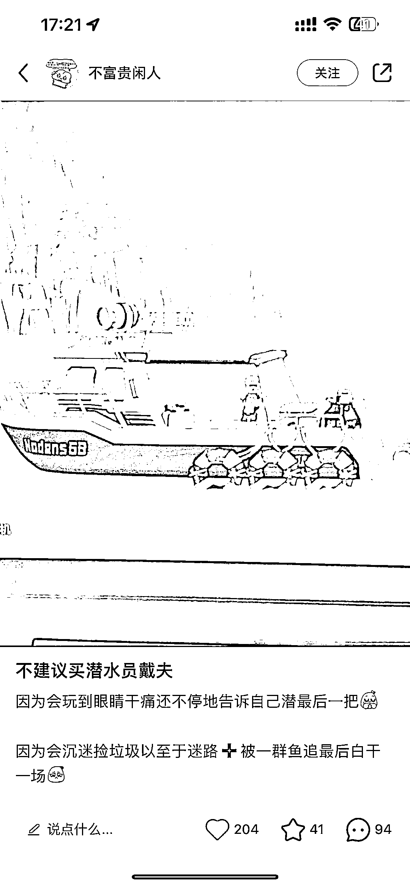
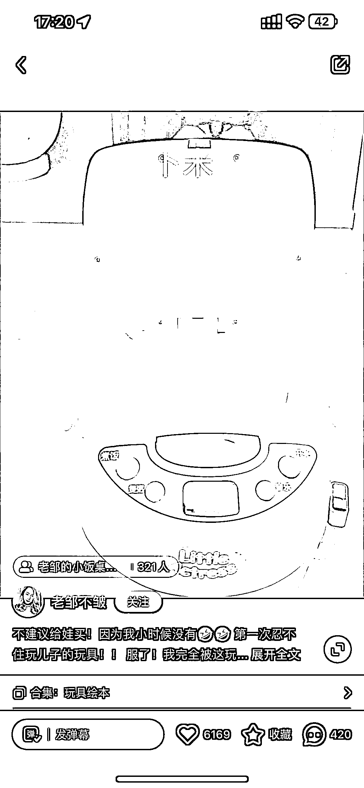

# （不建议 xxxxxx）小红书标题的反差之道

> 原文：[`www.yuque.com/for_lazy/xkrm14/erdtm6z6vtgy4psc`](https://www.yuque.com/for_lazy/xkrm14/erdtm6z6vtgy4psc)

作者： 红烧电饭煲

日期：2023-08-04

点赞数：147

正文：

小红书标题 小红书标题参考：【不建议 xxxxxx】 正文却写 xxxx（产品/服务）真的好到爆，给到一个反差 利用负面刺激，激发好奇心和对负面信息的敏感度，提高笔记打开率！ 最近想买个游戏（潜水员戴夫），结果小红书通知刚好推荐一篇：不建议买潜水员戴夫 直接就把我吸引住了想来看看为啥不建议，看完觉得人家能这么沉迷更是验证了游戏（产品）的优质，更想买了 联想到不管是淘宝购物还是大众点评吃个饭，都会优先看看评价，中评或差评的情况自己能不能接受再下单 这种操作直接利用读者对负面信息的敏感度去消除了负面信息的顾虑 搜了一下带货笔记，数据都还不错

  

  

  

评论区：

小白脸 : 反向操作

一卒 : 利用读者对负面信息敏感度去除负面顾虑，好思路[强][强]

孟大富 : 这个就跟 我想去搜 6 月某地区旅游的攻略，她的标题是 6 月千万不要来，越是禁止什么越是能吸引

Yao : 逆向思维

公众号懒人找资源，懒人专属群分享

