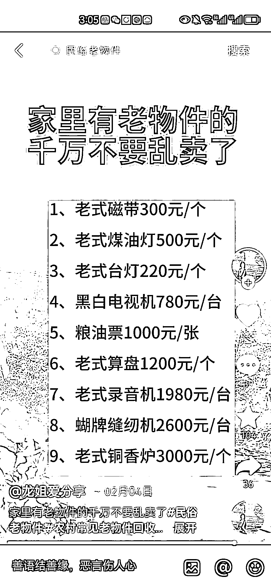

# 农村老物件回收与再利用：城市化进程中的商机

> 原文：[`www.yuque.com/for_lazy/xkrm14/ihceyqkrq1cqxp8i`](https://www.yuque.com/for_lazy/xkrm14/ihceyqkrq1cqxp8i)

<ne-text id="ubbeb46ed">作者： 长尧</ne-text>

<ne-text id="u50d73c9a">日期：2023-08-10</ne-text>

<ne-text id="u68847763">点赞数：</ne-text><ne-text id="ud450bb4e" ne-bold="true">83</ne-text>

<ne-hole id="u67ad9470" data-lake-id="u67ad9470"><ne-card data-card-name="hr" data-card-type="block" id="GDyE9" data-event-boundary="card">

<ne-text id="u98d153a9">正文：</ne-text>

<ne-text id="u3f16c8ea">随着城市化进程的加速，许多农村家庭不再使用或需要老物件。可以开展回收农村老物件的生意，例如旧家具、陶瓷器具、农具等。通过与农村居民建立信任关系，提供合理的价格和便捷的回收服务，获得农村老物件。通过修复、翻新等方式，将这些物品再次销售或转手给收藏家、设计师、民宿、特色旅游公司等，获取利润。典型的非标产品，报价任你想象。一件对年轻人来说新鲜的老物件，猜猜用途，能带来很多流量。</ne-text>

<ne-card data-card-name="image" data-card-type="inline" id="fohW4" data-event-boundary="card"></ne-card>

<ne-card data-card-name="image" data-card-type="inline" id="vZ6T6" data-event-boundary="card"></ne-card>

<ne-hole id="u4cec48bf" data-lake-id="u4cec48bf"><ne-card data-card-name="hr" data-card-type="block" id="Z28Gc" data-event-boundary="card">

<ne-text id="ue672f374">评论区：</ne-text>

<ne-hole id="ue17f6b06" data-lake-id="ue17f6b06"><ne-card data-card-name="hr" data-card-type="block" id="caL1h" data-event-boundary="card">

<ne-text id="u7c75b4a3">公众号懒人找资源，懒人专属群分享</ne-text>

</ne-card></ne-hole></ne-card></ne-hole></ne-card></ne-hole>